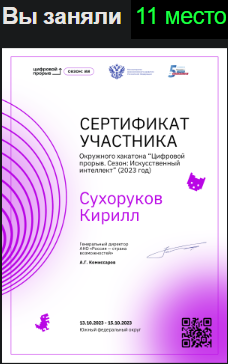

<h1 align="center">Acceptance of documents</h1>

  
	
	

<h1>Установка и использование</h1>

  
  Устанавливаем зависимости `pip install -r requirements.txt` 
  
  Разархивируем в папку корневую папку прокета архивы `М-11.rar` и `ФМУ-76.rar` с тренировочными данными.
  
  Если вы хотите добавить свои pdf файлы, то переместити их в папки `М-11` и `ФМУ-76`, если они формы М-11 и ФМУ-76 соответсвенно.
  
  После чего запустите файлы `ParseM11.py` и `ParserФМУ76.py`, чтобы выполнить анализ файлов и получить допущенные ошибки в каждом из файлов

  <h1>Уникальность нашего проекта</h1>

  Особенностью продукта является создание собственной программы для извлечения данных из файлов, использование специальных алгоритмов для проверки правильности заполнения и высокая скорость работы программы

  <h1>Задачи на будущее</h1>

 

  <ol>
   <li>Создание базы правил заполнения форм документов</li>
   <li>Интеграция многопоточности</li>
   <li>Улучшение качества работы с фото</li>
   <li>Добавление AR-технологий</li>
   <li>Внедрение нейросетей</li>
   <li>Добавление интерфейса</li>
  </ol>

<h1>Результаты работы программы</h1>

 

  

  <h1>Итоги хакатона</h1>
  

<h2 align="center"> Star History</h2>

<a href="https://star-history.com/#K1rsN7/Acceptance-of-documents&Date">
 <picture>
   <source media="(prefers-color-scheme: dark)" srcset="https://api.star-history.com/svg?repos=K1rsN7/Acceptance-of-documents&type=Date&theme=dark" />
   <source media="(prefers-color-scheme: light)" srcset="https://api.star-history.com/svg?repos=K1rsN7/Acceptance-of-documents&type=Date" />
   
 </picture>
</a>

